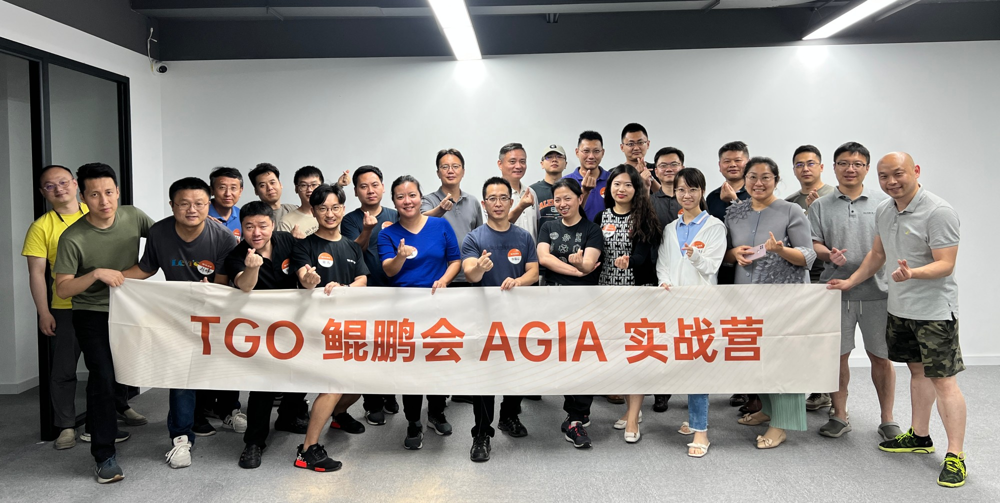

  <a href="./meetuplist.md">线下沙龙</a> |
  <a href="https://jinshuju.net/f/K1UnOv">申请加入</a> |
  <a href="./blog.md">技术博客</a> |

## AGIA实战营是什么 

AGIA 实战营（AGI in Action），是由 20 位 [TGO 鲲鹏会](https://tgo.infoq.cn/)会员共同发起的，成员以大模型方向的创业者和中高层技术管理者为主。AGIA 实战营定期组织线下沙龙深度交流实战案例，聚合资源，助力大模型更快落地。。
  

- 组织名称：AGIA（AGI in Action）-AGIA 实战营
- 愿景：成为东半球最有影响力的**大模型开放社区**
- 使命：推动100个实战需求落地
- 价值观：实战落地 实战落地 实战落地
- 项目主页：https://github.com/TGO-AGIA/AGIA
- 墙内主页：https://gitee.com/good_bai/AGIA
- 面向人群：
  - 1 [TGO 鲲鹏会](https://tgo.infoq.cn/)会员；
  - 2 所有关注 AGI 实战落地的朋友；
- 主理人: 古德白（白新奋）

## 人员

### 核心贡献者
  
|  *  |  *  |  *  |  *  |   *  |
| --- | --- | --- | --- | --- |
| 张建华@递零科技|   李伟@溢恩科技     |  邵晓春@智谱ai   | 李国山@小择智能  |沈博文@瓦力数科             |
|    孙志博     |    龙凡@寻路猫科技  |   陆云昆       |白新奋（古德白）@随手ai创始人 | 项先经 |

### 专家团成员
  
| 序号 | 嘉宾姓名 | 嘉宾公司名称及职位名称 |
|---|---|---|
| 1 | 李波 | 乐言科技, CTO |
| 2 | 李雪晴 | 猴子无限, 联合创始人&商业化负责人 |
| 3 | 龙凡 | 寻路猫, 联创 &CTO |
| 4 | 陆云昆 | 钢蜂信息科技, CTO |
| 5 | 沈博文 | 瓦力数科, 创始人&CTO |
| 6 | 周元剑 | 澜码科技, 联合创始人 |
| 7 | 胡溢洋 | 太水科技, CTO |
| 8 | 杨晶生 | 飞书AI团队, 技术负责人 |
| 9 | 王仿 | 智谱, GLM 大模型解决方案负责人 |
| 10 | 桂林 | 传音控股IM产品部, 技术负责人 |
| 11 | 陈烨博士 | 虎博科技, 创始人&CEO |
| 12 | 梁宇鹏（一乐） | 蓝莺IM, 创始人兼CEO |
| 13 | 华琨 | 优司服, 创始人兼CEO |
| 14 | 孙其瑞 | 杭州优频, CTO |
| 15 | 樊伟伟 | 微鲤科技, 硏发总监 |
| 16 | 丁鹏 | 万界智算, CTO |
| 17 | 卢亿雷 | 白海科技, CEO |
| 18 | 李三平博士 | 肇聪科技, 创始人&CEO |
| 19 | 王朝成 | 超梦视影 ＆ 泛超科技, 总经理 ＆ VP |
| 20 | 谢明炫 | Vrch.io末亓科技, 创始人 |
| 21 | 房玉峰(大房） | 上海忻知联创, CTO |
| 22 | 王博龙 | 会读Readflow, CEO |
| 23 | 郎瀚威 | -, 独立A研究员 |
| 24 | 林文丰 | 靖亚资本, 高级投资经理 |
| 25 | 王斌 | 逗炫科技, 创始人 |
| 26 | 洪倍 | ValueZ智库，前AdMaster联创, 创始人 |
| 27 | 王松 | 未来智能, CTO |
| 28 | 孙鹏飞 | 南京出门问问信息科技有限公司, 研发总监 |
| 29 | 杨滨 | 彬驰科技, 创始人&董事长 |
| 30 | 杨攀 | 极容邦科技, 副总裁 |
| 31 | 艾芙（徐雁斐） | 南瓜博士, 公众号主笔 |
| 32 | 王闻宇 | PPIO派欧云, 联合创始人&CTO |
| 33 | 姚航 |   清昂智能，联合创始人兼 COO|
| 34 | 欧阳卓媛  | TensorsLab，联合创始人 |
| 35 | 方懿 |   上海中联律师事务所，合伙人 |
| 36 | 黄哲铿 （Mr.K）   | 顿悟山丘，创始人 |

### 所有创始成员：  
建华@递零科技, 邓军@数据领航, 丁鹏@万界数据, 周毅Joey@顿匠科技, 张广智, 宜博@LLMFarm.com, 林刚@万国数据, 李国山, 李伟@溢恩科技, 李聪, 孙其瑞@ai视觉, 徐季秋, 老白@随手科技, Richard Wang(王军)@深演智能, 龙斌@知室, 龙凡@寻路猫科技, wallace王华锋, 江冬勤@LinkWechat, 邵晓春, Zhibo, 陆云昆  

## 线下沙龙记录

| 序号 |    场次     |   主题     |  主持人/组织者  |    日期    |
| --- | ----------- |---------- |-------------- |---------- |
| 1 | [AGIA第一期](./meetuplist.md#AGIA第一期)  |  | ValueZ创始人 洪倍| 2023年5月31日（周三） |
|  2 |  [AGIA第二期](./meetuplist.md#AGIA第二期-SD专场) |   SD专场 |张建华 递零科技 CEO |2023年06月15日（周三）
|  3 | [AGIA第三期](./meetuplist.md#AGIA第三期-数字员工专场) |   数字员工专场 |小择智能 李国山 |2023年06月28日（周三）
|  4 |  [AGIA第四期](./meetuplist.md#AGIA第四期-走进商汤+知识库专场) |走进商汤+知识库专场 |溢恩科技创始人李伟| 2023年07月12日（周三）
|  5 |  [AGIA第五期](./meetuplist.md#AGIA第五期-tigerbot专场) |  tigerbot专场 |溢恩科技创始人李伟| 2023年07月26日（周三）
|  6 |  [AGIA第六期](./meetuplist.md#AGIA第六期-武汉专场) | 武汉专场||  2023年07月30日 (星期日)
|  7 |  [AGIA第七期](./meetuplist.md#AGIA第七期-ai音频专场) |  ai+音频专场 |寻路猫联创龙凡| 2023年08月09日（周三）
|  8 |  [AGIA第八期](./meetuplist.md#AGIA第八期-Ai-agent专场) | Ai agent专场 |Ucloud 邵晓春 | 2023年08月23日（周三）
|  9 |  [AGIA第九期](./meetuplist.md#AGIA第九期) || 陆云昆 钢蜂信息科技 CTO| 2023年9月13日（周三）
|  10 |  [AGIA第九期.2](./meetuplist.md#AGIA第九期2-上海GTLC闭门会专场) |  上海GTLC闭门会专场| ValueZ创始人 洪倍| 2023年09月23日 
|  11 |  [AGIA第十期](./meetuplist.md#AGIA第十期-数字人专场) |  数字人专场| 张建华 递零科技 CEO| 2023年09月27日（周三）
|  12 |  [AGIA第十一期](./meetuplist.md#AGIA第十一期-全局视角专场) |  全局视角专场| 李国山 小择智能 创始人| 2023年10月11日（周三）
|  11 |  [AGIA第十期](./meetuplist.md#AGIA第十期-数字人专场) |  数字人专场| 张建华 递零科技 CEO| 2023年09月27日（周三）
|  12 |  [AGIA第十一期](./meetuplist.md#AGIA第十一期-全局视角专场) |  全局视角专场| 李国山 小择智能 创始人| 2023年10月11日（周三）
|  13 |  [AGIA第十二期](./meetuplist.md#AGIA第十二期) |   | 沈博文 瓦力数科创始人 | 2023年10月25日（周三）
|  14 |  [AGIA第十三期](./meetuplist.md#AGIA第十三期) |   | 溢恩科技创始人李伟| 2023年11月08日（周三） 
|  15 |  [AGIA第十四期](./meetuplist.md#AGIA第十四期) |   | 孙志博 深查智能 联创 | 2023年11月22日（周三） 
|  16 |  [AGIA第十五期](./meetuplist.md#AGIA第十五期) |   | 邵晓春 智谱 AI | 2023年12月06日（周三） 
|  17 |  [AGIA第十六期](./meetuplist.md#AGIA第十六期) | 走进伍董会-圣诞专场  | 邵晓春 智谱 AI | 2023年12月20日（周三） 

## 为什么要有这个小组
ChatGPT爆火，AGI 从天降临，新时代的序幕已经拉开。自文艺复兴 300 年来，最大的社会范式革命出现了。不管是你是踌躇满志想要改变世界的创业者，还是每天在用键盘在战斗的程序员，现在都应该沉下心来真真做点事情，亲手下载开源模型跑一跑，基于或者 ChatGPT/SD API 包个壳 APP 都是不错的尝试，无论如何都应该练练手熟。当你真正上手尝试，就会发现真正落地一个应用并不简单：百模争霸到底谁家更胜一筹，政策法律风险如何规避，toC 还是 toB 哪种商业模式更好……种种问题都需要深度的持续的交流。这正是实战营组织的目的。

如果是在收获的季节，毋庸置疑，抡起麻袋抢果子摘是最好的策略。但今天，AGI 方向显然还是播种的春季，到底是什么样的种子、种在什么土壤、使用什么样的培养方式才能丰收，并不是明确的，需要生态内的共同探索。所以，希望加入我们的会员都是心态开放的，可以务实交流的，认可“分享就是收获”的理念。

## 路线图
- [x] AGIA组织建立
- [ ] 完成从需求种子-闭门会-实战落地-Github主页上线的闭环实践
- [ ] 启动全国招募1000个实战需求
- [ ] 成立10个小组来推进落地100个需求

## 我们主要关注商业化落地
- 垂直行业大模型落地的机会、挑战、探索
- 各种大模型能力探索
- 政策法律风险
- 大模型技术及其演进路线

## 加入我们的好处
- 1 每天与全球优秀大模型技术前沿商业化落地实践者交流碰撞，发现机会；
- 2 线下闭门沙龙优先参与资格；
- 3 赞助商提供的免费算力；
- 4 各种行业内测资格优先获得。 

## 如何加入我们
申请链接：https://jinshuju.net/f/K1UnOv  

提交一份申请表单，用 300 字阐述一下你正在思考想要落地的一些想法或者做法。
我们非常欢迎这三类人员加入：
- 程序员，正在run 大模型/ fine tune/包壳
- 创业者，正在思考一些idea并已着手做了工作（文档、产品或者客户访谈）
- 需求者，有数据或者有较明确的需求场景，但不知道如何解决

## 鸣谢赞助商
- 万界数据
GPU算力赞助商：http://wanjiedata.com/home  

欢迎更多赞助商，算力、小礼品都欢迎，也欢迎行业内各组织联系合办活动。联系方式 good_bai # qq.com

## ----------

| AGIA 主页二维码 |    申请加入二维码     |  
| ----------------- | --------------- |
| |  |

